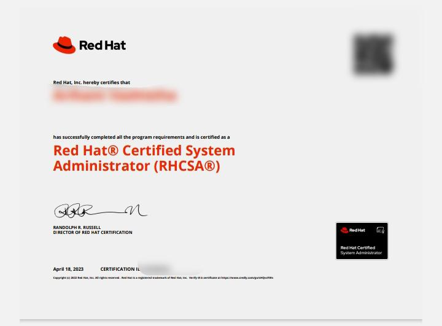
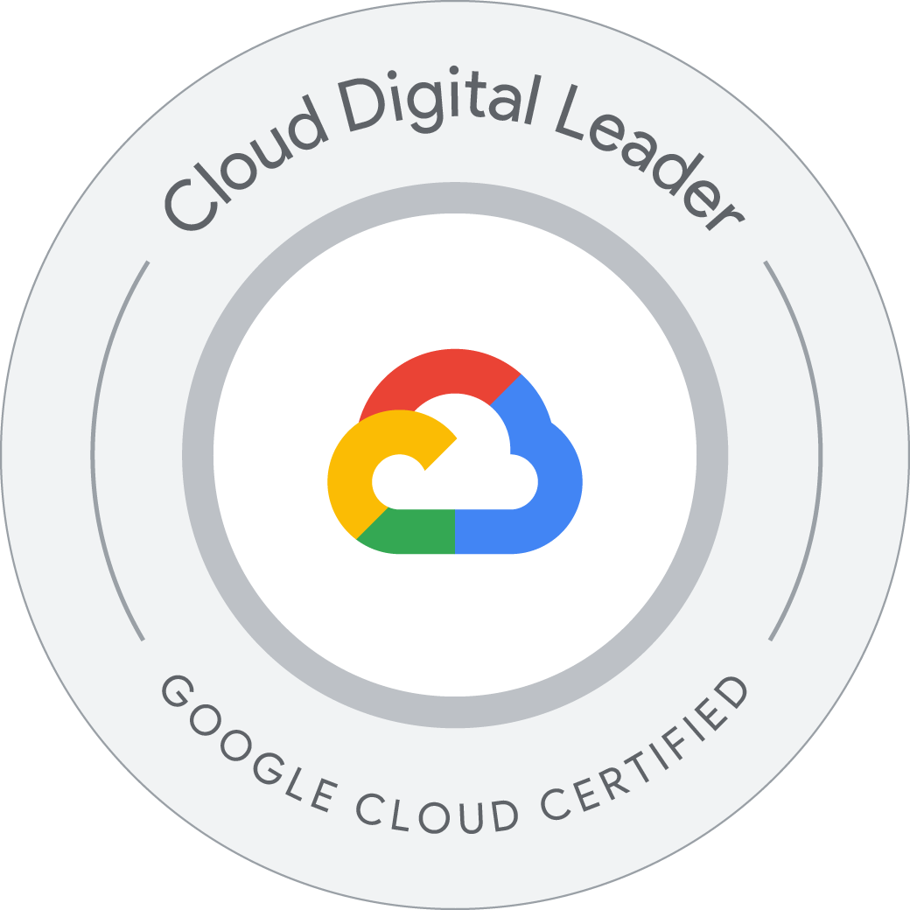

# Certificate Portfolio

Welcome to my certificate portfolio! This repository serves as a personal showcase of my academic and professional certifications.  
Feel free to explore the certificates below, each including a preview and a link to verify (if available).

---

## 📜 Certificates

| Certificate Title | Description | Preview Image | View / Verify |
|------------------|-------------|----------------|----------------|
| **Red Hat Certified System Administrator (RHCSA)** | Credential demonstrating core system administration skills required in Red Hat Enterprise Linux environments. |  | [🔗 Verify](https://www.credly.com/badges) |
| **Google Cloud Digital Leader** | Validates knowledge of basic Google Cloud concepts and services. Ideal for non-technical and technical users. |  | [🔗 Verify](https://www.credly.com/badges) |

---

## 📁 How to Use This Template

Want to create your own certificate portfolio like this?

1. **Fork this repository** or download it.
2. Replace the example rows in the table above with your own certificate details.
3. Add your certificate images to the `/images` folder.
4. Optionally, include public verification links (Certify, Credly, Cloud Skills Boost, etc.)
5. Commit your changes — and your portfolio is live!

---

